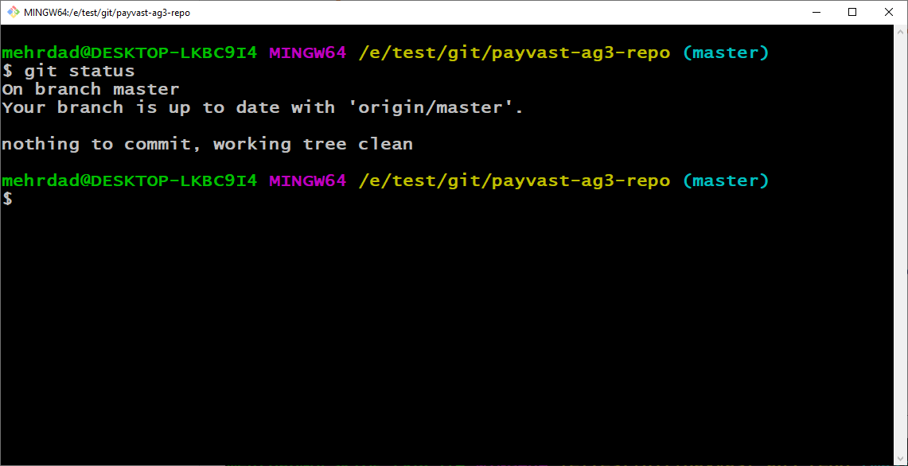
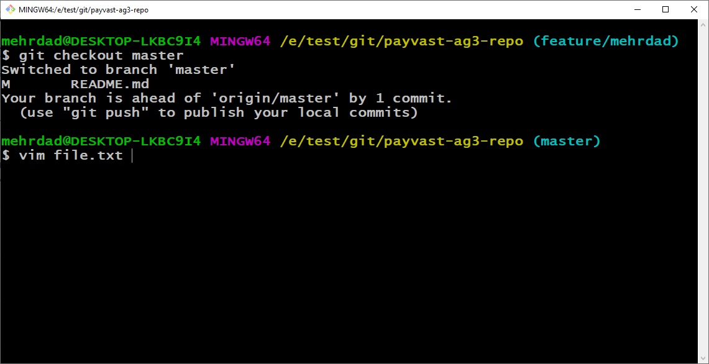

<h1>
	<p dir="rtl" align="center">به نام خدا</p>
</h1>


# payvast-ag3-repo

this is a payvast **AG3** repository 
loation is [AG3 Repo](http://localhost:3001/payvast/payvast-ag3-repo)


# نصب گیت در ویندوز 

<p dir="rtl" align="right">
جهت نصب گیت در ویندوز ابتدا به سایت <a href="http://git-scm.com">گیت</a> رفته و از پنل دانلود ها گیت برای ویندوز را دانلود کنید.مطابق تصویر زیر.
</p>


<p dir="rtl" align="right">
مجوز عمومی گنو را مرور کنید و وقتی آماده نصب شدید ، روی Next کلیک کنید
</p>


<p dir="rtl" align="right">
گیت محل نصب را از شما درخواست می کند. محل نصب پیش فرض در Program File می باشد(بهتر است در همین مکان بماند) و در صورت علاقه به تغییر آن محل مورد نظر خود را انتخاب کرده و روی Next کلیک کنید.
</p>


<p dir="rtl" align="right">
صفحه انتخاب مؤلفه (component selection) ظاهر می شود. پیش فرض ها را رها کنید مگر اینکه نیاز خاصی به تغییر آنها داشته باشید و روی Next کلیک کنید.
</p>


<p dir="rtl" align="right">
نصب کننده می خواهد پوشه منوی شروع (start menu folder) را ایجاد کند. بر روی Next کلیک کنید.
</p>


<p dir="rtl" align="right">
ویرایشگر متنی را که می خواهید با Git استفاده کنید انتخاب کنید.(در محیط bash برای کارهای مختلف متنی) از منوی کشویی هر ویرایشگر متنی که ترجیح می دهید را انتخاب کنید بهتر است به فرم پیش فرض همان ویرایشگر قدرتمند vim باشد(توضیح داده خواهد شد) ولی می توانید ویرایش گرهای دیگری مثل notepad++ را هم برای استفاده انتخاب کنید (مانند شکل) و Next را بزنید.
</p>


<p dir="rtl" align="right">
این مرحله نصب به شما امکان می دهد محیط PATH را تغییر دهید.  PATH  مجموعه پیش فرض دایرکتوری ها است که هنگام اجرای یک دستور از خط فرمان ، شامل می شود. (هر دستوری که در گیت انجام می شود یک فایل اجرای در این محیط و پوشه دارد) این گزینه را در قسمت وسط (توصیه شده) بگذارید "Git From the command line and also from 3rd-party software"و روی Next کلیک کنید
</p>


<h3>
<p dir="rtl" align="right">
شبیه سازهای ترمینال
</p>
</h3>

<p dir="rtl" align="right">
این قسمت مربوط به گواهینامه های سرور است. بیشتر کاربران باید از پیش فرض استفاده کنند(پیش فرض)  .گر در یک محیط Active Directory  کار می کنید ، ممکن است لازم باشد به گواهی های Windows Store تغییر دهید. روی Next کلیک کنید
</p>


<p dir="rtl" align="right">
مرحله بعدی line ending را مشخص می کند. توصیه می شود که انتخاب پیش فرض را قبول کنید (“Checkout Windows-style, commit Unix-style line endings”). این مربوط به نحوه شکل گیری داده ها و تغییر این گزینه ممکن است باعث ایجاد مشکلاتی شود. روی Next کلیک کنید
</p>


<p dir="rtl" align="right">
در مرحله بعدی شبیه ساز ترمینال مورد نظر خود را انتخاب کنید. پیش فرض برای ویژگی های آن توصیه می شود.( MinTTY ) و سپس روی Next  کلیک کنید
</p>


<h3>
<p dir="rtl" align="right">
گزینه های اضافی سفارشی سازی
</p>
</h3>

<p dir="rtl" align="right">
گزینه های پیش فرض توصیه می شود ، اما این مرحله به شما امکان می دهد تصمیم بگیرید کدام گزینه اضافی را که می خواهید فعال کنید. اگر از پیوندهای نمادین استفاده می کنید ، که مانند میانبرهای خط فرمان است ، کادر را تیک بزنید(Enable symbolic links). و بعد روی Next کلیک کنید
</p>


<p dir="rtl" align="right">
بسته به نسخه Git شما در حال نصب هستید ، ممکن است نصب ویژگی های آزمایشی را ارائه دهد.  گزینه گنجاندن گزینه های تعاملی ارائه شد. آن را بدون تیک رها کنید و روی نصب کلیک کنید. تا فرایند نصب گیت آغاز گردد.
</p>


<p dir="rtl" align="right">
بعد از نصب روی دکمه finish کلیک کنید
</p>


### congratulation

<h3>
<p dir="rtl" align="right">
نحوه راه اندازی Git در ویندوز
</p>
</h3>

<p dir="rtl" align="right">
برای راه اندازی Git Bash ، منوی Windows Start را باز کنید ، git bash  را تایپ کنید و Enter را فشار دهید.
</p>


<p dir="rtl" align="right">
برای راه اندازی Git GUI  (بعدا در مورد git gui  صحبت می کنیم) ، منوی Windows Start را باز کنید ، git gui   را تایپ کنید و Enter را فشار دهید.
</p>


<p dir="rtl" align="right">
برای راه اندازی gitk که یک واسط گرافیکی (ویزارد) دیگر برای گیت می باشد هم منوی Windows Start را باز کنید ، gitk   را تایپ کنید و Enter را فشار دهید.
</p>


<p dir="rtl" align="right">
در محیط git bash برای تست درست کار کردن آن 2 دستور زیر را که برای نمایش مکان ذخیره شدن برنامه git  (which git) و ورژن برنامه git می باشد را اجرا می کنیم.
</p>

```
which git
git --version
```


## git status
<p dir="rtl" align="right">
به طور کلی برای درک کلیه دستورات گیت ، می باید با سه مفهوم اصلی <b>Working Directory</b> ، <b>StagingArea</b>و  <b>Repository</b>در گیت آشنایی داشته باشید. عکس زیر به خوبی شما را در این امر کمک می کند و می توانید با استفاده از آن، کلیه این سه حالت را گیت درک کنید.
</p>


<p dir="rtl" align="right">
سه وضعیت کلی در پروژه‌های گیت وجود دارد که شامل موارد زیر می‌شود:
</p>


1. **staged**
2. **committed**
3. **modified**

### stage

<p dir="rtl" align="right">
بعد از تغییراتی در کد و استفاده از دستور ```git add``` این تغییرات در <b>stage</b> ذخیره می شوند.
</p>


<p dir="rtl" align="right">
در شکل زیر مراحل مختلف گردش کار در یک پروژه گیت را می توانید ببینید
</p>


## بررسی مخزن گیت
<p dir="rtl" align="right">
می‌توانید وضعیت مخزن <b>گیت</b> را هر زمان که می‌خواهید با استفاده از دستور زیر بررسی کنید
</p>

```
git status
```

<p dir="rtl" align="right">
همانطور که در تصویر زیر مشاهده می کنید مخزن هیچ مورد تغییر یا ویرایشی را در خود ندارد
</p>



<p dir="rtl" align="right">
حالا فرض کنیدی فایلی به نام main.py را به پروژه اضافه کردید با این کار و بعد انجام دوباره دستور بالا (<b>git status</b>) می بینید که فایل فوق با رنگ <b>قرمز</b> مشخص شده و نشان دهنده این است که این فایل در مخزن محلی قرار دارد (working directory)
</p>


## stage
<p dir="rtl" align="right">
در این مرحله می خواهیم فایل ایجاد شده را در <b>stage</b> قرار دهیم. برای این منظور باید از دستور زیر استفاده کنیم.
</p>

```
git add main.py
```


<p dir="rtl" align="right">
<h3>نکته</h3>
</p>

<p dir="rtl" align="right">
برای افزودن چند فایل به طور همزمان می توان نام فایل ها را به ترتیب و با فاصله کنار هم در stage اضافه کرد. به عنوان مثال فرض کنید ما 3 فایل با نام های file1.txt و file2.txt و file3.txt داریم برای افزودن همزمان این 3 فایل به stage از کد زیر استفاده می شود.
</p>

```
git add file1.txt file2.txt file3.txt
```

<p dir="rtl" align="right">
<h3>نکته</h3>
</p>

<p dir="rtl" align="right">
برای افزودن تمام  فایل ها و پوشه های جدید یا ویرایش شده پروژه در<b>stage</b>.از کدی مثل زیر استفاده می شود.
</p>

```
git add .
```

## local repository

<p dir="rtl" align="right">
در مرحله بعدی باید فایل های موجود در stage را به <b>local repository</b> منتقل کرد که برای این کار از دستور <b>commit</b>  استفاده می گردد. برای استفاده از این دستور باید با استفاده از سوییچ –m و قرار دادن یک پیام اقدام به ذخیره فایل های خود در مخزن محلی کنید.
</p>

```
git commit -m "add main.py file to repository"
```


## remote repository

<p dir="rtl" align="right">
در مرحله آخر باید فایل های موجود در مخزن محلی را به remote repository منتقل کرد که برای این منظور نیز از دستور push استفاده می گردد. که باید نام مخزنی را که در آن قرار داریم به عنوان هدف ذخیره قرار گیرد.مطابق با دستور زیر.
</p>

```
git push origin master
```


<p dir="rtl" align="right">
<h3>نکته</h3>
</p>

<p dir="rtl" align="right">
متن درج شده در <b>commit</b> کاملا اختیاری می باشد ولی بهتر است متنی باشد که در مراحل بعد متوجه تغییرات در مخزن شویم. در صورت عدم درج سوییچ –m گیت شما را به صفحه ادیتور پیش فرض که برایش تعریف کرده اید می برد تا در آنجا متن مورد نظر خود را تایپ کنید. در گیت به فرم پیش فرض از ویرایشگر متنی قدرتمند vim استفاده می شود.(در قسمت های پایین در مورد این ادیتور صحبت می شود). برای تایپ در این ادیتور ابتدا دکمه i را زده و ادیتور به حالت ویرایشی می رود بعد از تایپ متن مورد نظر خود دکمه esc را زده و با تایپ عبارت <b>:wqa</b>  (دستورات در vim با : شروع می شوند و هر کلمه معادل یک حرکت خاص می باشد به عنوان مثال w به منظور write کردن متن و q به منظور خروج یا quit استفاده می گردد) از ادیتور متن را ذخیره و خارج می شوید.
</p>

<p dir="rtl" align="right">
بعد از تایپ دستور <b>git commit</b>صفحه زیر نمایش داده می شود.
</p>


<p dir="rtl" align="right">
برای ورود به مد ویرایش کلمه <b>i</b> را فشار دهید (در قسمت پایین صفحه عبارت – INSERT – نشان دهنده ورود به این مد می باشد). و اقدام به تایپ متن مورد نظر کنید (در بالای صفحه می توان عبارت مورد نظر را مشاهده کرد با رنگ زرد در اینجا شما حتی می توانید comment خود را در چند خط و با enter از هم جدا کنید)
</p>


<p dir="rtl" align="right">
در نهایت و بعد از تایپ عبارت مورد نظر کلمه escape در کی برد(دکمه Esc) را فشار داده و عبارت :wqa را تایپ کنید (ماننده پایین صفحه شکل زیر). و در نهایت اقدام به ذخیره با زدن دکمه Enter کنید.
</p>


<p dir="rtl" align="right">
همانطور که در شکل می بینید بعد از برگشت از ادیتور متن مورد نظر در commit درج گردیده است.
</p>


## unstage repository

<p dir="rtl" align="right">
می‌توانید به سادگی فایل‌ها را از قسمت stage نیز حذف کنید(ممکن است به اشتباه فایلی را به stage با دستور git add ارسال کرده باشید) برای این کار باید از دستور زیر استفاده شود.(در اینجا منظور از filename نام فایل مورد نظر می باشد)
</p>

```
git rm --cached filename
```

<p dir="rtl" align="right">
اگر می‌خواهید پوشه‌ها را نیز حذف کنید به یک پرچم –r نیازمندید
</p>

```
git rm --cached -r foldername
```

<p dir="rtl" align="right">
برای حذف چند فایل هم می شود با فاصله آنها را یکجا از stage حذف کرد.
</p>


```
git rm --cached file1 file2 file3
```

<p dir="rtl" align="right">
برای اینکه تمام فایل‌ها و دایرکتوری‌ها را یکجا حذف کنید می‌توانید به صورت زیر عمل کنید
</p>

```
git rm --cached -r .
```


## نمایش تاریخچه کامل کامیت‌ها
### LOG
 
<p dir="rtl" align="right">
برای مشاهده همه commit های انجام شده در پروژه می توانید از دستور git log استفاده کنید. با اجرای این دستور، آیتم های مربوط به commit به نمایش در می آیند. این آیتم ها که در هر لاگ به نمایش در می آیند عبارتند از:
</p>


1. **Commit ID** : <p dir="rtl" align="right">که ID مربوط به هر کامیت می باشد که عددی منحصر به فرد است.</p>
2. **Author** : <p dir="rtl" align="right">کسی که commit را انجام داده است (شامل نام او به همراه آدرس ایمیل فرد)</p>
3. **Date** : <p dir="rtl" align="right">تاریخ انجام commit را نمایش می دهد.</p>
4. **Message** : <p dir="rtl" align="right">پیامی را که در هر commit ثبت می شود را نمایش می دهد.</p>


```
git log
```


### نکته

<p dir="rtl" align="right">
شناسه (id) هر commit بسیار مهم بوده و می شود از آن برای برگرداندن نسخه محلی به یک نسخه مشخص در مخزن ریموت استفاده کرد. در پایین درباره این مورد توضیح می دهیم.
</p>

### نکته


<p dir="rtl" align="right">
نمایش لاگ به همراه فایل هایی که در هر commit تغییر یافته اند
<br />
برای نمایش اینکه در هر commit چه فایل هایی تغییر کرده اند، از دستور git log –stat  به صورت زیر استفاده می کنید
</p>

```
git log --stat
```


### نکته

<p dir="rtl" align="right">
نمایش commit ها به صورت گراف
<br />
برای نمایش  به صورت گراف، از دستور git log –graph استفاده می شود. از این دستور برای نمایش branch ها و همین طور commit ها به شکل گراف استفاده می شود.
</p>


```
git log --graph
```


### نکته

<p dir="rtl" align="right">
نمایش commit ها به صورت خطی
<br />
برای نمایش  commit ها به شکل خطی، از دستور git log –oneline استفاده می شود. با این دستور کل commit ها به صورت خطی و پشت سر هم در صفحه به نمایش در می آیند.
</p>


```
git log --oneline
```


### نکته

<p dir="rtl" align="right">
مشاهده جزئیات کامل هر commit
<br />
جهت نمایش جزئیات کامل هر commit و تغییرات انجام شده در آن، می توانید از دستور git log -p استفاده کنید.
</p>


```
git log -p
```


### نکته

<p dir="rtl" align="right">
نمایش n کامیت آخربه صورت خطی
<br />
برای نمایش n کامیت آخر (مثلا 5 کامیت آخر در پروژه) می توانید از دستور git log -n –oneline استفاده کنید. با این دستور n تا commit آخر فقط به نمایش در می آیند.
</p>


```
git log -4 --oneline 
```


### نکته

<p dir="rtl" align="right">
نمایش لاگ های با فرمت دلخواه
<br />
شما می توانید از فرمت خاص برای نمایش لاگ های commit های خود در گیت استفاده کنید. برای نمایش خلاصه و منظم ، عموما از دستور git log –pretty=format به همراه فرمت دلخواه خود، استفاده می شود.
</p>


```
git log --graph --pretty=format:'%Cred%h%Creset -%C(green)%d%Creset %s %Cgreen(%cr) %C(bold red)<%an>%Creset' --abbrev-commit
```


No | command | Description
------------ | ------------- | -------------
1  | %n | ایجاد یک خط جدید 
2  | %% | نمایش کاراکتر %
3  | %Cred | تغییر رنگ به قرمز
4  | %Cgreen | تغییر رنگ به سبز
5  | %Cblue | تغییر رنگ به آبی
6  | %Creset | پاک کردن رنگ
7  | %T | نمایش به فرم درختی
8  | %an | نام اقدام کننده commit
9  | %ae | نمایش ایمیل اقدام کننده به commit
10  | %ad | تاریخ commit
11  | %as | نمایش تاریخ کوتاه commit 

[git format](https://git-scm.com/docs/pretty-formats)


### خلاصه دستورات لاگ در گیت

No | Git Log Command | Description
------------ | ------------- | -------------
1 | ```git log``` | Show log without any format
2 | ```git log --stat``` | Show log with files which are changed in each commit
3 | ```git log --graph``` | show log as a graph
4 | ```git log --oneline``` | show log as one line
5 | ```git log -5 --oneline``` | show last 5 commits as oneline
6 | ```git log --merge``` | show only log related to branches merge
7 | ```git log -p``` | show log with each specification in each commit
8 | ```git log --graph --pretty=format:'%Cred%h%Creset -%C(green)%d%Creset %s %Cgreen(%cr) %C(bold red)<%an>%Creset' --abbrev-commit``` | Show log with pretty format


# clone

<p dir="rtl" align="right">
یعنی یک مخزن (repository) را دقیقا مشابهش را روی سیستم خود بسازید.و البته دسترسی به فایل ها ،  commit های قبلی در مخزن و ... برای این کار در git از دستوری مشابه زیر استفاده می شود.
</p>

```
git clone repo_address
```


```
git clone https://github.com/mehrdadTemp/git-toturial.git
```

### نکته

<p dir="rtl" align="right">
جهت دریافت تغییرات کاربران دیگر از مخزن اصلی هم از دستور زیر استفاده می گردد.
</p>

```
git pull origin master
```

<p dir="rtl" align="right">
البته بجای master می توان نام شاخه مورد نظر را درج کرد
</p>


# شاخه (Branch)
<p dir="rtl" align="right">
در صورتی که بخواهید شاخه های متفاوتی را در توسعه کدهای خود داشته باشید، از مفهومی به نام branch در گیت استفاده می کنید. در واقع با استفاده از branch شما از شلوغی ها و بی نظمی هایی که در هنگام کار تیمی ممکن است پیش بیاید، جلوگیری می کنید.
برای اینکه پس از توسعه، هر branch را با feature های اصلی به شاخه اصلی خود یا همان master اضافه کنید، کافی است از دستورات گیت با نام های merge و rebase استفاده کنید.
</p>

<p dir="rtl" align="right">
<b>نحوه ساخت یک branch جدید و وارد شدن در آن</b>
<br />
برای ساخت یک branch جدید و وارد شدن به آن یا همان checkout کردن به آن از دستور git checkout -b به همراه نام branch استفاده می کنیم.
همچنین برای ساخت و ایجاد یک branch می توانید از دستور git branch به همراه نام آن شاخه استفاده کنید.
</p>

```
git checkout -b  mehrdad
```


### نکته

<p dir="rtl" align="right">
برای برگشت سریع به شاخه قبلی از دستور زیر استفاده گردد.
</p>

```
git checkout -
```


<p dir="rtl" align="right">
رفتن به یک شاخه دیگر در گیت
برای جابجایی از یک شاخه به شاخه دیگر کافی است از دستور git checkout به همراه نام branch مربوطه استفاده کنیم.
</p>

```
git checkout master
```


### نکته

<p dir="rtl" align="right">
<b>
نمایش کلیه شاخه های موجود در یک پروژه
</b>
</p>

<p dir="rtl" align="right">
برای دیدن کلیه branch های موجود در یک پروژه می توانید از دستور git branch -a استفاده کنید.
</p>

```
git branch -a
```

### توضیح

<p dir="rtl" align="right">
در شکل زیر مشاهده می گردد که پروژه شامل چند شاخه با نام های mehrdad و master می باشد. سبز بودن master نیز نشانه این بوده که این شاخه در حال حاضر برای کاربر فوق فعال می باشد(در این شاخه قرار دارد).
</p>


### نکته

<p dir="rtl" align="right">
<b>
پاک کردن یک شاخه در گیت
</b>
</p>


<p dir="rtl" align="right">
جهت حذف نمودن یک branch در گیت کافی است از دستور git branch -d به همراه نام branch استفاده کنید.
در اینجا ما شاخه mehrdad را حذف کردیم
</p>

```
git branch -d mehrdad
```


<p dir="rtl" align="right">
در صورتی که در شاخه مورد نظر برای حذف موردی باشد که هنوز commit نشده اجازه حذف به شما داده نمی شود در صورت اینکه حتما می خواهید فایل حذف شود از سوییچ –D (بزرگ) استفاده گردد.
</p>

```
git branch -D mehrdad
```

### نکته

<p dir="rtl" align="right">
<b>
دیدن کلیه شاخه ها در remote
</b>
</p>

<p dir="rtl" align="right">
جهت دیدن کلیه branch ها برای حالت های fetch و همین طور push می توانید از دستور remote -v استفاده کنید.
</p>

```
git remote -v
```


### git branch commands

No | Git Branch Command | Description
------------ | ------------- | -------------
1 | ```git branch mehrdad``` | Create a new branch
2 | ```git checkout -b mehrdad``` | Create a new branch and checkout in new branch
3 | ```git checkout master``` | Checkout to master
4 | ```git branch --help``` <br/> ```git branch -h``` | Show helps for branch
5 | ```git branch -a``` | Show all branches in a project
6 | ```git branch -d mehrdad``` | Remove mehrdad branch
7 | ```git remote -v``` | View current remotes
8 | ```git remote rm destination``` | Remove remote


# merge 

<p dir="rtl" align="right">
<b>
انجام عملیات ترکیب branch ها
</b>
</p>

<p dir="rtl" align="right">
برای انجام ترکیب بین دو شاخه مثلا شاخه mehrdd و شاخه master ، کافی است ابتدا به شاخه master وارد شوید و سپس دستور  git merge mehrdad را اجرا کنید.
برای دیدن نتایج آن (که آیا merge به درستی صورت گرفته است یا خیر) می توانید پس از انجام این کار در شاخه master از دستور git log –graph استفاده کنید.
</p>

```
git merge mehrdad
```


```
git log -graph
```


### بیان ساده ای از دستور merge

<p dir="rtl" align="right">
بعد از اتمام کار و نهایی شدن کد یک شاخه، لازم است کدهای شاخه با یک شاخه‌ی دیگه  معمولاً (master) ترکیب شود. گاهی اوقات هم می‌خوایم تغییراتی که در یک شاخه‌ی سومی وجود داره را  وارد شاخه‌ای که درحال کار در آن هستیم کنیم. در این مواقع باید از دستور merge استفاده کنیم. برای merge اول باید وارد شاخه‌ی مقصد بشویم(با دستورcheckout ) و سپس با دستور مناسب شاخه‌ی ثانویه رو با مقصد ترکیب کنیم.
</p>

```
git checkout dest
git merge source
```

### نکته

<p dir="rtl" align="right">
اگر مشکلی اتفاق نیفتد merge ما به صورت fast-forward اتفاق می افتد. بدین معنی که بدون هیچ تداخلی (conflict) انجام می گیرد. در غیر اینصورت ابتدا باید کانفلیکت‌ها را برطرف کنیم (در قسمت های بعدی در برباره این مورد صحبت می کنیم) و بعد از اتمام یک کامیت  merge انجام دهیم. با استفاده از پرچم ‎--no-ff می شود کاری کنیم که در هر صورت commit merge  ساخته بشه. چه ادغام fast-forwardd  باشه و بدون commit اضافه انجام بشه و چه تداخل اتفاق بیفته و commit merge ضروری باشد.
</p>

# بازگردانی کارها با استفاده از دستورات گیت

<p dir="rtl" align="right">
در حین کار در پروژه خود، ممکن است نیاز داشته باشید تا در مراحل مختلف، تغییرات انجام شده را نادیده بگیرید و دوباره بخواهید فایل های قبلی خود را بازگردانی نمایید.
در این حالت است که می باید از دستورات مربوط به <b>undo </b> کردن کارها در گیت استفاده کنید. برای این کار عموما از اشکال مختلف دستور <b>reset</b> استفاده می شود که در ادامه به صورت کامل به حالت های مختلف آن اشاره می کنیم.
</p>


<h2>
<p dir="rtl" align="right">
بازگردانی تغییرات پیش از اضافه کردن فایل ها به Staging Area
</p>
</h2>

<p dir="rtl" align="right">
این حالت زمانی اتفاق می افتد که شما تغییراتی را در فایل های خود انجام داده اید اما هنوز فایل های خود را به <b>Staging Area</b> اضافه یا همان <b>add</b> نکرده اید.
مثلا فرض کنید فایل main.py را تغییر داده اید و بدون <b>add</b> کردن آن، تصمیم دارید تغییرات موجود را به <b>حالت قبل</b> بازگردانی کنید.
در این حالت می توانید از دستورزیر استفاده کنید تا فایل مورد نظر به حالت قبل از تغییرات بازگردد.
</p>

```
git checkout -- main.py
```


<h2>
<p dir="rtl" align="right">
بازگردانی فایل ها، زمانی که در Staging Area می باشند
</p>
</h2>

<p dir="rtl" align="right">
در این حالت شما به عنوان مثال تغییراتی را در فایل <b>main.py</b> انجام داده اید و آن را به   <b>Staging Area</b> اضافه کرده اید. در این حالت برای بازگردانی فایل به Working Directory  می توانید از دستور <b>git reset HEAD</b>  به همراه نام فایل استفاده کنید. در واقع با انجام این دستور، شما فایل مورد نظر خود را  <b>Unstage</b>کرده اید.
</p>

```
git reset HEAD main.py
```

### نکته

<p dir="rtl" align="right">
با اجرای کد بالا فایل فقط از stage خارج می شود و برای حذف تغییرات باید دوباره دستور git checkout – main.py را بزنیم
</p>


<h2>
<p dir="rtl" align="right">
بازگردانی commit انجام شده به حالت Stage
</p>
</h2>

<p dir="rtl" align="right">
فرض کنید که شما یک commit را انجام داده اید. برای بازگرداندن این commit  به حالت stage (حالت قبل ازcommit  (  درآورید، کافی است از دستور git reset –soft به همراه ID مربوط به آن commit استفاده کنید.در این حالت فایل هایی که <b>commit</b>  کرده اید، به حالتstage  باز گردانده خواهند شد.
</p>

```
git reset --soft  COMMITID
```
 
### نکته

<p dir="rtl" align="right">
برای گرفتن لیست شناسه (id) لاگ ها از دستور git log استفاده کنید
</p>

    


### نکته

<p dir="rtl" align="right">
بازگردانی تغییرات commit شده به مرحله Working Space
</p>
<p dir="rtl" align="right">
در صورتی که بخواهید فایل های یک commit را به حالت Working Space بازگردانید، کافی است از دستور git reset –-mixed به همراه commit ID مربوط به آن استفاده کنید.
</p>

```
git reset --mixed  COMMITID
```


# Add And Commit In One Line

<p dir="rtl" align="right">
commit کردن همه فایلهای موجود در stage
</p>
<p dir="rtl" align="right">
به طور همزمان، هم فایل ها راadd  میکنیم و هم commit  میکنیم و توضیحی برای commit قرار می دهیم.برای این منظور از سوییچ –am در دستور استفاده می کنیم
</p>

```
git commit -am  "commit message"
```


# Git UI

<p dir="rtl" align="right">
در بعضی مواقع دوست دارید به جای استفاده از محیط CLI از واسط گرافیکی یا به اصطلاح wizard برای کارهای مختلف استفاده کنید بدین منظور دستور زیر را در محیط  cli تایپ کرده تا پنجره گرافیکی گیت برای شما باز گردد.
</p>

```
git gui 
```


<p dir="rtl" align="right">
برای مشاهده لیست تغییرات (افزوده شده ها ، تغییر کرده ها و حذف شده ها) در ویزارد از منوی بالا قسمت <b>commit</b> و سپس قسمت <b>Rescan</b> را انتخاب می کنیم.
</p>


<p dir="rtl" align="right">
حال لیست فایل های تغییر یافته در قسمت </b>“Unstaged Changes“<b> قرار می گیرند مطابق با شکل زیر.(با کلیک روی هر فایل می توان تغییرات آنرا در روبه روی آن نیز دید.
</p>


<p dir="rtl" align="right">
در مرحله بعدی برای انتقال لیست فایل ها از </b>stage<b> به repository (commit) باید مطابق شکل زیر از منو و قسمت commit قسمت <b>Stage To Commit</b> را انتخاب کنید.
</p>


<p dir="rtl" align="right">
همانطور که در شکل زیر ملاحظه می کنید فایل ها در مخزن محلی قرار گرفته اند و بعد از تایپ یک پیغام برای commit روی دکمه کلیک می کنیم تا فرایند ذخیره در مخزن محلی نیز انجام گیرد.  بعد از آن و با کلیک روی دکمه push نیز امکان ذخیره فایل ها در مخزن ریموت فراهم می شود.
</p>


<p dir="rtl" align="right">
 کلیک روی دکمه push و باز شدن ویزارد آن و انتخاب مخزن (اینجا master) فایل ها در مخزن اصلی نیز ذخیره می گردند. مطابق 2 شکل رو به رو
</p>


# gitk   vs  git gui

<p dir="rtl" align="right">
در حالی که gitk  به پیمایش و نمایش تاریخچه یک مخزن می پردازد ، git gui  به پالایش شخصی commit  و سابقه پروژه می پردازد
</p> 

## مزایای git gui
1. راحتی در commit
2. امکان merge ، push و pull

## مزایای gitk
1. نمایش تاریخچه و درخت git


### نکته

<p dir="rtl" align="right">
با زدن دستور git gui دیگر محیط خط فرمان (cli) قابل استفاده نیست و تا بستن ویزارد قفل می شود برای باز کردن ویزارد در یک نخ (thread)  جدا از دستور زیر استفاده کنید.
</p>

```
git-gui
```

[gitk and git-gui document](https://riptutorial.com/git/example/18336/gitk-and-git-gui)

# branch in github

<p dir="rtl" align="right">
جهت ساخت یک شاخه (<b>branch</b>) جدید در پروژه روش های مختلفی وجود دارد. می توان با اجرای دستور زیر یک شاخه ساخت (بدون ورود به شاخه جدید). در دستور زیر <b>branch1</b> نام شاخه می باشد. و می تواند هر نامی داشته باشد.
</p> 

```
git branch branch1
```


<p dir="rtl" align="right">
حال برای ورود به <b>شاخه</b> جدید باید از دستور <b>checkout</b> استفاده شود مطابق دستور و شکل زیر.
</p>

```
git checkout branch1
```


<p dir="rtl" align="right">
بعد از ورود به شاخه با اجرای دستور <b>merge</b> می توان شاخه فوق را به روز کرد. <b>البته اگه شاخه جدید باشد</b> نیازی به این کار نیست زیرا شاخه جدید ایجاد شده است.
</p>


<p dir="rtl" align="right">
حال با <b>push</b> کردن این شاخه جدید آنرا درمخزن remote هم ایجاد می کنیم مطابق 2 شکل زیر.
</p>


<p dir="rtl" align="right">
برای ایجاد یک شاخه و رفتن به داخل آن به فرم مستقیم از سوییچ <b>–b</b> در دستور chekout استفاده می شود. به دستور زیر توجه کنین که شاخه جدیدی به نام branch2 ایجاد کرده و بلافاصله به داخل آن می رویم.
</p>


```
git checkout -b branch2
```


### نکته

<p dir="rtl" align="right">
برای حذف یک شاخه از سوییچ <b>–d</b> استفاده می شود مطابق شکل زیر که شاخه branch1 در آن حذف گردیده است.
</p>

```
git branch -d branch1
```


### نکته

<p dir="rtl" align="right">
برای حذف یک شاخه که هنوز داخل آن merge اتفاق نیوفتاده است دقیقا مثل branch2 برای حذف از سوییچ <b>–D</b> استفاده می شود مطابق شکل زیر که شاخه branch2 در آن حذف گردیده است.
</p>

```
git checkout master
git branch -D branch2
```

# بررسی یک مثال

<p dir="rtl" align="right">
فرض کنید مطابق شکل زیر ما در شاخه اصلی (master) هستیم. و در حال حاضر در commit با نام c2 قرار داریم.
</p>


<p dir="rtl" align="right">
حال شاخه ای با نام branch1 را ساخته و وارد آن شاخه می شویم.
</p>

```
git checkout -b branch1
```


<p dir="rtl" align="right">
در شاخه branch1 اقدام به ویرایش یک فایل به نام index.html کرده و commit می کنیم. (رفتن به مرحله c3 در شاخه branch1) و شاخه master در همان commit شماره c2 می ماند.
</p>

```
vim  index.html
git commit -a -m "generate index.html in branch1"
```


<p dir="rtl" align="right">
حال دوباره به شاخه اصلی (master) بازگشته و اقدام به ایجاد یک شاخه جدید دیگری به نام branch2 می کنیم. و در داخل این شاخه اقدام به ویرایش فایل index.html کرده و آنرا هم commit می کنیم.
</p>

```
git checkout master
git checkout -b branch2
vim index.html
git commit -a -m "generate new index.html"
```


<p dir="rtl" align="right">
حال به شاخه اصلی (master) بازگشته و با شاخه branch2 ادغام (merge) می کنیم مطابق با شکل زیر
</p>

```
git checkout master
git merge branch2
```


<p dir="rtl" align="right">
حال اقدام به حذف شاخه branch2 کرده و سپس دوباره به شاخه branch1 بازگشته و فایل index.html را ویرایش کرده و سپس commit  می کنیم (تولید commit جدیدی با نام c5)
</p>

```
git branch -d  branch2
git checkout branch1
vim index.html
git commit -a -m "modify index.html"
```


<p dir="rtl" align="right">
حال به شاخه master بازگشته و این شاخه را با شاخه branch1 ادغام می کنیم. در صورت بروز conflict باید ابتدا مشکلات رفع گردد و سپس بعد رفع کردن مشکلات فایل را commit  کنیم (ایجاد حالت c6)
</p>

```
git checkout master
git merge branch1
#  if occur conflicted here first fixed 
git commit -a -m "merge and commit"
```


<p dir="rtl" align="right">
در نهایت نیز اقدام به حذف شاخه branch1 می کنیم.
</p>

```
git branch -d branch1
```


# اسم مستعار

<p dir="rtl" align="right">
در گیت نیز امکان تعریف اسم مستعار (alias) نیز وجود دارد. جهت ذخیره این اسم مستعار در کل ماشین کاربر از سوییچ –qlobal استفاده می شود. این نام ها درفایل مشخصی با نام .gitconfig قرار می گیرند که در ویندوز در مسیر %USERPROFILE%\.gitconfig و در سیستم عامل لینوکس در مسیر $HOME/.gitconfig قرار می گیرد. شما می توانید این فایل را باز کرده و به طور دستی مقادیر داخل آن را ویرایش کنید. ولی بهتر است با استفاده از دستور زیر اقدام به ویرایش این فایل کنید.
</p>

```
git config --global aliasName "git command name"
```

<p dir="rtl" align="right">
برای تعریف یک نام و ایمیل برای خود در git مشابه زیر دستورات را وارد کنید.
</p>

```
git config --global user.name  "Mehrdad Salehi"
git config --global user.email mehrdad.temp@gmail.com
```

### نکته

<p dir="rtl" align="right">
حال فرض کنید می خواهیم به جای دستور commit فقط 2 کلمه co را تایپ کنیم و همینطور به جای دستور checkout از 2 حرف ch استفاده کنیم. برای این منظور از دستور زیر استفاده می کنیم.
</p>

```
git config --global alias.co "commit"
git config --global alias.ch "checkout"	
```

### نکته

<p dir="rtl" align="right">
البته می شود در فایل .gitconfig هم  به فرم زیر این دستورات را اضافه کرد
</p>


```
[alias]
    co = commit
    ch = checkout
```

<p dir="rtl" align="right">
حال برای تست به مثال زیر توجه کنید
</p>

```
git co -m "insert new file"
```

### نکته

<p dir="rtl" align="right">
البته می شود از دستورات هم در اینجا استفاده کرد به عنوان مثال برای خارج کردن فایل ها از stage می شود از خلاصه ساز زیر استفاده کرد.
</p>

```
git config --global alias.unstage "reset --"
```

<p dir="rtl" align="right">
مثال
</p>

```
git unstage
```

# pull

<p dir="rtl" align="right">
در حقیقت وظیفه این دستور گرفتن تغییرات از مخزن راهدور (remote repository) و انتقال آن به مخزن محلی می باشد. مطابق با دستور زیر. (این دستور تغریبا معادل با دستور update در SVN می باشد.
</p>

```
git pull
```

### نکته

<p dir="rtl" align="right">
البته می توان از 2 دستور زیر نیز که مشابه دستور pull هستند استفاده کرد.
</p>

```
git fetch 
git merge FETCH_HEAD
```

### نکته

<p dir="rtl" align="right">
به طور دقیق تر ، pull ، سر شاخه بازیابی شده را به شاخه فعلی ادغام کند. با استفاده از سوییچ --rebase ، به جای ادغام git ، بازگرداندن (rebase)  git را اجرا می کند.(به زودی در مورد دستور rebase صحبت می کنیم)
</p> 


# rebase


1. <p dir="rtl" align="right">Rebase روشی دیگر(مشابه با دستور merge) برای ادغام تغییرات از یک شاخه به یک شاخه دیگر است. Rebase تمام تغییرات را در یک  وصله(patch) فشرده‌سازی کرده، و سپس وصله مورد نظر را در یک شاخه (branch) هدف ادغام می‌کند.</p>
2. <p dir="rtl" align="right">Rebase کردن بر خلاف merge کردن، تاریخچه را از بین می برد به این خاطرکه ابزار کار تمکیل شده را از یک شاخه به یک شاخه دیگر منتقل می‌نماید. در این روند، تاریخچه مذکور ناخواسته از بین می‌رود.</p>
3. <p dir="rtl" align="right">Rebaseها، نحوه منتقل شدن تغییرات از بالای سلسله مراتب به سمت پایین و mergeها هم نحوه جریان یافتن آن‌ها به سمت بالا هستند.</p>

<p dir="rtl" align="right">
rebaseو mege هر دو برای یکپارچه سازی تغییرات از یک branch به branch دیگر طراحی شده اند اما هر یک به روش مختلفی این کار را انجام می دهند.
در شکل زیر به branch ی که تغییرات در آن صورت گرفته و یا ويژگی های جدیدی به آن اضافه شده feature branch و به branch ی که می خواهیم روی آن ادغام انجام شود master branch می گوییم.
برای مثال، بیاید در نظر بگیریم که ما commit هایی به صورت زیر داریم، نتیجه merge به صورت ترکیب commit ها خواهد بود در حالیکه rebase همه تغییرات در feature branch را از شروع آخرین commit از master branch اضافه می کند. مطابق شکل زیر
</p>


 
### نکات مثبت

No | توضیحات
------------ | -------------  
1 | <p dir="rtl" align="right">یک تاریخچه پیچیده را ساده‌سازی می‌کند.</p>
2 | <p dir="rtl" align="right">دستکاری یک commit تنها ساده است. </p>
3 | <p dir="rtl" align="right">با تبدیل کردن commitهای حد واسط به یک commit تنها که می‌تواند برای گروه‌های توسعه دهنده کاربردی باشد، آن‌ها را مرتب می‌کند.</p>

### نکات منفی

No | توضیحات
------------ | -------------  
1 | <p dir="rtl" align="right">له کردن یک feature در قالب چند commit، می‌تواند زمینه را مخفی کند.</p>
2 | <p dir="rtl" align="right">Rebase کردن مخازن عمومی می‌تواند در هنگام کار به عنوان یک تیم، خطرناک باشد.</p>
3 | <p dir="rtl" align="right">کار بیشتری مورد نیاز است: استفاده از rebase برای بروز نگه داشتن شاخه ویژگی خود.</p>
4 | <p dir="rtl" align="right">Rebase کردن با شاخه‌های کنترل از راه دور، نیاز دارد که شما آن را force push‌ کنید. بزرگ‌ترین مشکلی که افراد با آن مواجه می‌شوند، این است که force push کرده‌اند، اما git push default را تنظیم نکرده‌اند. این به یک سری بروزرسانی در تمام شاخه‌ها ختم می‌شود که نام مشابهی دارند، و این مسئله وحشتناک است.</p>
    
### نکته مهم

<p dir="rtl" align="right">
اگر شما به طور ناصحیحی rebase‌ می‌کنید و به طور غیر عمدی تاریخچه را بازنویسی می‌کنید، این موضوع می‌تواند به مشکلات جدی ختم شود؛ پس مطمئن شوید که می‌دانید چه کاری انجام می‌دهید. 
</p>

<h3>
<p dir="rtl" align="right">
شاخه feature را با استفاده از این دستورات، به یک شاخه اصلی rebase کنید:
</p>
</h3>

<h4>
<p dir="rtl" align="right">
قبل از rebase
</p>
</h4>


```
git checkout feature
git rebase master
```


<h3>
<p dir="rtl" align="right">
Rebase‌ کردن تعاملی
</p>
</h3> 

<p dir="rtl" align="right">
این کار دستکاری کردن commitها را همینطور که به شاخه جدید منتقل می‌شوند، ممکن می‌سازد و از rebase‌ کردن خودکار بسیار قدرتمندتر است؛ زیرا یک کنترل کامل را بر روی تاریخچه commit شاخه ارائه می‌دهد. معمولا این کار برای تمیز کردن یک تاریخچه به هم ریخته، قبل از ادغام یک شاخه ویژگی در قالب شاخه اصلی انجام می‌شود.
</p>

```
$ git checkout feature
$ git rebase -i master
```

<p dir="rtl" align="right">
این کار با لیست کردن تمام commitهایی که قرار است منتقل شوند، ویرایشگر را باز می‌کند.
</p>

```
pick 22d6d7c Commit message#1
pick 44e8a9b Commit message#2
pick 79f1d2h Commit message#3
```

<p dir="rtl" align="right">
این کد تعریف می‌کند که شاخه‌ها پس از اجرای rebase دقیقا چه ظاهری خواهند داشت. شما با بازچینی موجودیت‌ها می‌توانید تاریخچه را به هر شکلی که می‌خواهید در آورید. برای مثال، شما می‌توانید از دستوراتی مانند fixup، squash، edit و... به جای pick استفاده کنید.
</p>

<p dir="rtl" align="right">
مقدمه‌ای بر Git Merge و Git Rebase: این دو چه کاری انجام می‌دهند، و چه زمانی باید از آن‌ها استفاده کنیم؟
</p>

 

<h4>
<p dir="rtl" align="right">
کجا از rebase و کجا از merge استفاده کنیم
</p>
</h4>

No | توضیحات
------------ | -------------
1 | <p dir="rtl" align="right">شما در حال توسعه‌دهی به طور محلی هستید: اگر شما کارتان را با هیچ کس به اشتراک نگذاشته‌اید. در اینجا، شما بهتر است rebase کردن را به merge کردن ترجیح دهید، تا تاریخچه خود را مرتب نگه دارید. اگر شما مخزن شخصی خود را دارید و آن را با کسی به اشتراک نگذاشته‌اید، به راحتی می‌توانید rebase کنید.</p>
2 | <p dir="rtl" align="right">کد شما برای بازبینی آماده است: شما یک درخواست pull ساخته‌اید. افراد دیگر در حال بازبینی کار شما هستند. در اینجا، خوب نیست که کار خود را rebase کنید. شما باید commitهای rework بسازید و شاخه ویژگی‌‌های خود را بروزرسانی کنید. این کار به شما در قابلیت ردگیری در درخواست‌های pull کمک می‌کند و از اختلالات اتفاقی در تاریخچه جلوگیری می‌کند.</p>
3 | <p dir="rtl" align="right">بازبینی انجام شده است و آماده ادغام با شاخه هدف است. تبریک! کم مانده است که شاخه ویژگی خود را حذف کنید. با توجه به این که توسعه دهندگان از این پس دیگر در این تغییرات fetch-merge نخواهند کرد، حال شما فرصت تصفیه کردن تاریخچه خود را دارید. در اینجا، شما می‌توانید تاریخچه مذکور را بازنویسی کنید و commitهای اصلی را fold کنید. ساخت یک merge خارجی برای این commitها اختیاری است، اما ارزشش را دارد. این کار وقتی که ویژگی‌ها به شاخه اصلی بروند را ضبط می‌کند.</p>


###### بررسی یک مثال


<p dir="rtl" align="right">
حال کلیه اطلاعات را از مخزن اصلی در مخزن محلی بارگیری می کنیم با استفاده از دستور زیر
</p>

```
git pull
```


<p dir="rtl" align="right">
حال شاخه جدیدی در مخزن محلی با نام rebase-branch مطابق دستور زیر ایجاد می کنیم
</p>

```
git checkout –b rebase-branch
```


<p dir="rtl" align="right">
حال اقدام به commit می کنیم
</p>

<p dir="rtl" align="right">
همانطور که در شکل یر مشخص می شود یک state جدید ایجاد می شود
</p>

```
git commit –m ‘add new features’
```


<p dir="rtl" align="right">
حال فایل جدیدی به نام مثلا index.html را در پروژه اضافه می کنیم و در همین شاخه جدید آنرا commit می کنیم مطابق با دستورات و شکل زیر
</p>


```
git add index.html
git commit –m ‘add index.html’
```


<p dir="rtl" align="right">
حال فرض کنید در مخزن ریموت اصلی تغییر جدیدی داشتیم مطابق شکل زیر که یک گام به آن اضافه شده است.
</p>


<p dir="rtl" align="right">
حالا دوباره به شاخه master بازگشته 
</p>

```
git checkout master
```


<p dir="rtl" align="right">
و اقدام به دریافت تغییرات جدید از مخزن ریموت مطابق دستور و شکل زیر می کنیم.
</p>

```
git pull
```


<p dir="rtl" align="right">
حال دوباره به شاخه rebase-branch باز می گردیم
</p>

```
git checkout rebase-branch
```


<p dir="rtl" align="right">
حال با اجرای دستور rebase مطابق دستور زیر ما به آخرین تغییرات در شاخه اصلی می رویم و تغییرات شاخه جاری یعنی rebase-branch را بعد از آخرین تغییرات در شاخه master قرار می دهیم
</p>

```
git rebase master
```


<p dir="rtl" align="right">
حال به شاخه master باز می گردیم
</p>

```
git checkout master
```


<p dir="rtl" align="right">
حالا با اجرای مجدد دستور rebase مطابق کد زیر تغیرات شاخه rebase-branch در ادامه تغییرات ما در شاخه master قرار می گیرد.
</p>

<p dir="rtl" align="right">
حال اگر مشکلی در شاخه ایجاد شد آنرا رفع کرده و نسخه را به اصطلاح stable می کنیم.
</p>

```
git rebase rebase-branch
```


<p dir="rtl" align="right">
در نهایت تغییرات را در شاخه اصلی هم قرار می دهیم.
</p>

```
git push
```


<h3>
<p dir="rtl" align="right">
یکسری از دستورات کاربردی در گیت
</p>
</h3>


No | دستور  |  توضیحات |  تصویر
------------ | ------------- | ------------ | -------------
1 | ```git diff```  |  <p dir="rtl" align="right">با این دستور می‌توانید همه تغییرات فایل را به صورت محلی مشاهده کنید. یک نام فایل می‌تواند به آن الحاق شود تا تغییراتی را برای یک فایل نمایش دهد.</p> |  
2 | ```git blame my_file``` | <p dir="rtl" align="right">با این دستور می‌بینید که چه کسی چه چیزی را در my_file(اسم یک فایل خاص) تغییر داده است.</p>  |  
3 | ```git reflog``` | <p dir="rtl" align="right">سابقه‌ای از تغییراتی که در Head مخزن محلی صورت گرفته است را نمایش می‌دهد. این دستور برای یافتن موارد حذف شده مفید است.</p> | 
4 | ```git config --global core.editor "atom --wait"``` |  <p dir="rtl" align="right">برای این که اصلا وارد ویرایشگر Vim نشوید، می‌توانید ویرایشگر پیش‌فرض خود را در Git تغییر دهید. برای نمونه برای تغییر ویرایشگر پیش‌فرض به Atom می‌توانید از دستور زیر استفاده کنید:</p> |  <span></span>
5 | ```git config --global core.editor "'C:/Program Files (x86)/Notepad++/notepad++.exe' -multiInst -notabbar -nosession -noPlugin"``` |  <p dir="rtl" align="right">برای تعریف notepad++ به عنوان ادیتور پیش فرض به جای vim از دستور زیر استفاده کنید</p> |  <span></span>
6 | ```git diff branch1...branch2``` <br /> ```git diff branch1:file1  branch2:file1``` | <p dir="rtl" align="right">برای گرفتن اختلاف بین 2 شاخه مثلا master و mehrdad از کدی شبیه  ```git diff master…mehrdad``` استفاده می کنیم. (بین 2 نام شاخه 3 عدد نقطه قرار می دهیم). و برای گرفتن تفاوت بین یک فایل مشخص در 2 شاخه از علامت :  بین نام شاخه و نام فایل استفاده می شود (branch_name:file_name) . فرض کنید فایلی به نام main.py داریم حال برای مشاهده اختلاف از دستور ```git diff master:main.py  mehrdad:main.py``` استفاده می شود.</p> |  

# rm

<p dir="rtl" align="right">
این دستور برای حذف فایل ها از درخت جاری  (مخزن محلی و شاخه مشخص) در گیت استفاده می شود. در نمونه زیر مشاهده می شود که 3 فایل package1.py ، package2.py و package3.py به طور همزمان از مخزن محلی حذف شدند.
</p>

```
git rm package{2..4}.py
```


### نکته

<p dir="rtl" align="right">
برای حذف یک پوشه نیز از سوییچ –r  استفادی می گردد به عنوان مثال اگر در مخزن خود پوشه ای با نام newFolder دارید برای حذف آن از دستور زیر استفاده گردد.
</p>

```
git rm -r --cached newFolder
```   

# stash

<p dir="rtl" align="right">
در حقیقت برای برگرداندن مخزن محلی خود (و در شاخه جاری مثلا master) به آخرین commit که انجام داده ایم (حذف تغییرات خودمان) از دستور زیر استفاده می کنیم.
</p>

```
git stash
``` 

[git stash](https://git-scm.com/docs/git-stash)


# clean

<p dir="rtl" align="right">
هدف از clean حذف فایل‌های ردگیری نشده (untracked files) از مخزن محلی می باشد. به بیان واضح تر فایل های که تا به حال به stage (با دستور git add ) اضافه نشده اند و فقط در مخزن محلی ایجاد گردیده اند را فایل های ردگیری نشده گویند. به صورت پیش‌فرض فایل‌های ردگیری نشده از سوی gitignore. حذف نخواهند شد. اما این حالت را می‌توان تغییر داد!
</p>

```
git clone
```

# سوییچ های مهم این دستور
No | سوییچ  |  توضیحات  
------------ | ------------- | ------------ 
1 | -n  |   <p dir="rtl" align="right">یک اجرای آزمایشی پیش از حذف کردن هر چیزی است. در حقیقت برای اینکه ببینید چه چیزی را دارید حذف می کنید از این سوییچ استفاده می گردد</p>
2 | -f  |   <p dir="rtl" align="right">حذف واقعی فایل‌ها</p>
3 | -d  |   <p dir="rtl" align="right">حذف دایرکتوری‌های ردگیری نشده.  در حقیقت اگر در گیت از مسیر مشخصی برای حذف استفاده نشده باشد. فایل های داخل پوشه های که untracked هستند حذف نمی شوند برای این مشکل ما از این سوییچ –d  استفاده می کنیم تا کلیه فایل ها و پوشه های untrack را از مخزن محلی پاک کنیم</p>

<p dir="rtl" align="right">
برای توضیحات بیشترفرض کنید فایلی به نام test.py را ساخته(فایل کاملا  جدید) و آنرا ویرایش کرده اید. حالا اگر از دستور زیر استفاده کنید ملاحظه می شود که این فایل به فرم کامل از مخزن محلی حذف گردیده است.(untracked file) 
</p>

```
git clean -f
```


### نکته

<p dir="rtl" align="right">
برای این که درخت کاری(مخزن و شاخه جاری) تمیز بماند، باید دستور زیر را اجرا کنید. این دستور همه فایل‌ها و پوشه های که از سوی git ردگیری نمی‌شوند را حذف می‌کند.
</p>

```
git clean -df
```

<p dir="rtl" align="right">
و اگر می‌خواهید پیش از حذف ببینید که کدام فایل‌های ردگیری نشده حذف خواهند شد، در این صورت می‌توانید دستور زیر را اجرا کنید.
</p>

```
git clean –dn
```

### نکته

<p dir="rtl" align="right">
اگر بخواهیم برخی فایل‌ها را حذف کنیم، فایل‌های ردگیری‌شده را می‌توان با استفاده از این دستور حذف کرد
</p>

```
git rm file-path
```

<p dir="rtl" align="right">
file-path  هم مسیر و نام فایل حذفی می باشد (برای حذف بیش از یک فایل با جای خالی آنها را از هم جدا کنید.
</p>

### نکته

<p dir="rtl" align="right">
اگر فایل شما در محیط staging باشد، در این صورت باید فلگ force را نیزبه آن اضافه کنید مانند دستور زیر.
</p>

```
git rm file-path -f
```

### نکته

<p dir="rtl" align="right">
اگر بخواهید فایل‌های خاصی را از مخزن git حذف کنید. اما روی سیستم شما(مخزن محلی) همچنان باقی بمانند ، در این صورت می‌توانید دستور زیر را اجرا کنید.
</p>

```
git rm --cached file-path
```

[git clone](https://mirrors.edge.kernel.org/pub/software/scm/git/docs/git-clean.html) 

# Conflict

<p dir="rtl" align="right">
برای معرفی conflict و روش برطرف کردن آن با مثالی این مورد را بررسی می کنیم. فرض کنید فایل با نام file.txt را در شاخه master ایجاد کرده اید. و در ویرایش مقدار hello world را در آن درج کرده اید.در نهایت نیز این فایل را commit  می کنیم.
</p>


```
git add file.txt
git commit -m "create file.txt"
```

<p dir="rtl" align="right">
حال شاخه جدیدی به نام feature/mehrdad را ایجاد کرده و در آن اقدام به ویرایش فایل file.txt مطابق با شکل های زیر می کنیم.
</p>

```
git checkout -b  feature/mehrdad
```


<p dir="rtl" align="right">
حالا در اینجا در شاخه feature/mehrdad اقدام به commit کردن کرده و دوباره به شاخه master باز می گردیم.
</p>

```
git checkout master
```


<p dir="rtl" align="right">
و بعد از اعمال تغییرات جدید بر روی فایل file.txt می پردازیم و بعد از commit تغییرات. حال اگه اقدام به merge کردن با شاخه feature/mehrdad کنیم  با conflict  مواجه می شویم.
</p>





<p dir="rtl" align="right">
بعد از اجرای دستور زیر با conflict مواجه می شویم.
</p>

```
git merge feature/mehrdad
```

<p dir="rtl" align="right">
همونطور که مشاهده میکنید بعد از اجرا کردن این دستور،git  تلاش میکنه که بصورت اتوماتیک تغییرات file.txt رو ادغام یا merge کنه. ولی بخاطر اینکه هم در شاخه master و هم در شاخه feature/mehrdad تغییراتی بر روی یک خط از یک فایل داده شده است، git  نمیدونه کدوم مورد رو در نظر بگیره و به همین دلیل merge بصورت کامل انجام نمیشه.در اینجا هست که وارد حالت MERGING میشیم و به همین دلیل هم شاخه master به master|MERGING تبدیل میشه و به این معنی هست که شما باید conflictها رو برطرف کنید و مجددا commit رو اجرا کنید.مطابق شکل زیر
</p>


<p dir="rtl" align="right">
حال فایل file.txt را جهت ویرایش باز می کنیم
</p>


<p dir="rtl" align="right">
کدهایی که بین خط ```<<<<<< HEAD```  و  ```=======```قرار دارند، کدهایی هستند که در شاخه فعلی یا master  قرار دارند و کدهایی که بین    ```=======``` و    ```>>>>>>> feature/mehrdad```وجود دارد، کدهایی هستند که در شاخه feature/mehrdad قرار داشته‌اند. این دو خط همان دو خطی هستند که conflict در آنها رخ داده است.شما باید بین این دو کد یکی رو انتخاب کنید و دیگری رو بصورت دستی حذف کنید. همچنین میتونین بسته به شرایط پروژتون، هر دو مورد رو حذف یا هر دو مورد رو نگه دارید. 
</p>


<p dir="rtl" align="right">
حال فایل را تغییر داده و ذخیره می کنیم مطابق شکل زیر
</p>


<p dir="rtl" align="right">
خب تا اینجا merge conflict رو برطرف کردیم و حالا اگر merge conflict دیگری هم وجود داشته باشه، باید اونا رو هم به همین صورت برطرف کنیم. زمانی که همه merge conflictها رو برطرف کردید، باید دستور git commit رو اجرا کنید تا تغییرات مورد نظر انجام بشه و merge بصورت کامل انجام بشه و از حالت MERGING خارج بشیم.و دوباره به شاخه master برگردیم مطابق با شکل زیر
</p>

```
git add file.txt &&  git commit -m "merge conflict"
```


<p dir="rtl" align="right">
با اجرای این دستور به شاخه master باز می گردیم
</p>

 

### نکته

<p dir="rtl" align="right">
برای مشاهده لیست conflict ها (فایل های دارای تداخل) در گیت وقتی به حالت MERGING وارد می شوید از دستور زیر استفاده کنید.
</p>

```
git diff --name-only --diff-filter=U
```

 


### چند خطای مهم در گیت


No | خطا  |  توضیحات 
------------ | ------------- | ------------ 
1 | ```Please commit your changes or stash them before you switch branches. Aborting``` |   <p dir="rtl" align="right">دلیل این خطا این است که .شما نمی توانید با تغییرات محلی ادغام شویدبرای رفع این مشکل شما 3 انتخاب دارید.<ul><li><p dir="rtl" align="right">تغییرات خود را commit کنید مطابق دستور ```git commit –m “my message”``` </li></p><li><p dir="rtl" align="right">ذخیره کردن(stash) . در حقیقت عملیات stashing مثل یک پشته عمل می کند(در بالا توضیح داده شد). و تغییرات را ماننده پشته به ترتیب معکوس در آن قرار دهید (push).برای این کار ابتدا تایپ کنید ``` git stash ```  و بعد برای درج (pull) در stash دستور ``` git stash pop ``` را تایپ کنید</p></li><li><p dir="rtl" align="right"><b>صرفنظر از تغییرات محلی: </b>برای اینکه تغییرات خود را لغو کنید یا دستور ``` git reset --hard ``` را وارد کنید و یا دستور  ``` git checkout –t –f filename ``` برای لغو تغییرات فایل مورد نظر (filename هم نام فایل مشخص است)</p></li></ul></p>


# git mergetool

<p dir="rtl" align="right">
فرض کنید که دو شاخه master و feature/mehrdad در فایلی به نام test.txt مشکل دارند.و دچار conflict شده اند. برای دیدن ای مشکل از mergetool استفاده می شود.
</p>


```
git mergetool
```

<p dir="rtl" align="right">
با تایپ این دستور در bash صفحه ای مطابق شکل زیر باز می گردد. که دارای 3 بخش است 2 بخش کنار شاخه های هستند که دچار conflict شده اند و برای همین فایل می باشند. و قسمت مرکز هم مربوط به شاخه master|MERGE که دچار تناقض شده است . این دقیقا همان ادیتور vim می باشد و شما با تایپ کلمه i می توانید اقدام به تغییر فایل مرکزی کرده و بعد از رفع مشکل آنرا ذخیره کنید (زدن دکمه esc و تایپ :wqa برای خروج)
</p>


### نکته

<p dir="rtl" align="right">
در شکل می توان هر 3 بخش را تغییر داد قسمتی که در زیر آن خط نوار سفید وجود دارد فعال می باشد (پیش فرض قسمت مرکز) و برای تغییر فایل فعال باید از کلمات ترکیبی ctrl + w تا بین این 3 بخش سوییچ کرد و با زدن دکمه i وارد حالت ویرایش گردید.
</p>

<p dir="rtl" align="right">
ویرایشگرmergetool پیش فرض vimdiff می باشد که در صورت عدم آن با اجرای دستورات زیر به عنوان پیش فرض برای گیت شناخته می شود.
</p>

```
git config --global merge.tool vimdiff
git config --global merge.conflictstyle diff3
git config --global mergetool.prompt false
```


