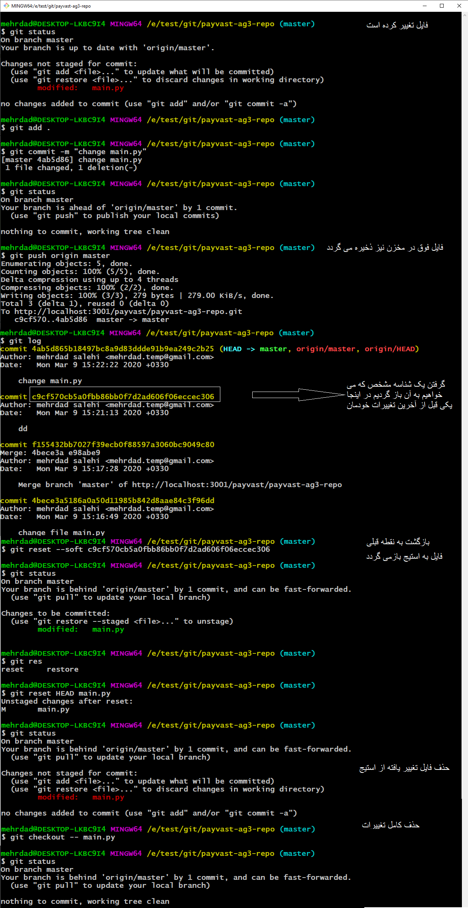
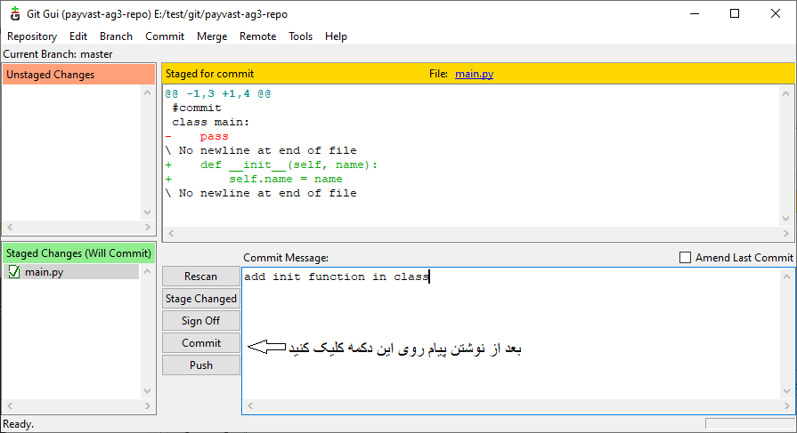
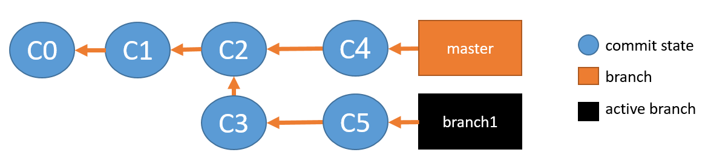
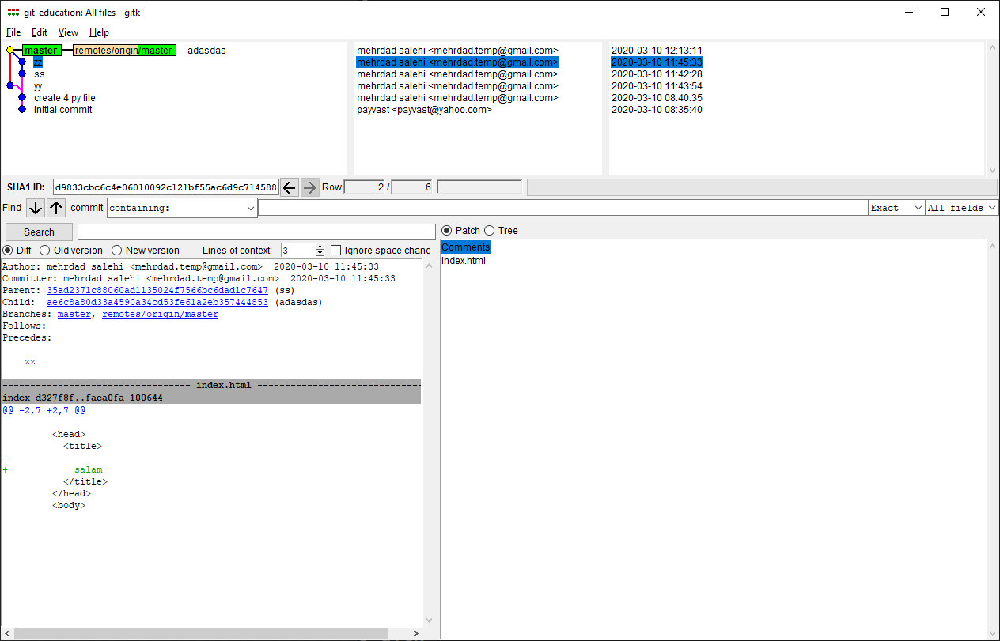

# payvast-ag3-repo

this is a payvasr **AG3** repository 
loation is [AG3 Repo](http://localhost:3001/payvast/payvast-ag3-repo)


## git status
<p dir="rtl" align="right">
به طور کلی برای درک کلیه دستورات گیت ، می باید با سه مفهوم اصلی <b>Working Directory</b> و <b>Staging Area</b> و  <b>Repository</b> در گیت آشنایی داشته باشید. عکس زیر به خوبی شما را در این امر کمک می کند و می توانید با استفاده از آن، کلیه دستورات گیت را به راحتی درک نمایید.
</p>


<p dir="rtl" align="right">
سه وضعیت کلی در پروژه‌های گیت وجود دارد که شامل موارد زیر می‌شود:
</p>


1. **staged**
2. **committed**
3. **modified**


<p dir="rtl" align="right">
در شکل زیر مراحل مختلف گردش کار در یک پروژه گیت را می توانید ببینید
</p>


## بررسی مخزن گیت
<p dir="rtl" align="right">
می‌توانید وضعیت مخزن <b>گیت</b> را هر زمان که می‌خواهید با استفاده از دستور زیر بررسی کنید
</p>

```
git status
```

<p dir="rtl" align="right">
همانطور که در تصویر زیر مشاهده می کنید مخزن هیچ مورد تغییر یا ویرایشی را در خود ندارد
</p>


<p dir="rtl" align="right">
حالا فرض کنیدی فایلی به نام main.py را به پروژه اضافه کردید با این کار و بعد انجام دوباره دستور بالا (<b>git status</b>) می بینید که فایل فوق با رنگ <b>قرمز</b> مشخص شده و نشان دهنده این است که این فایل در مخزن محلی قرار دارد (working directory)
</p>


## stage
<p dir="rtl" align="right">
در این مرحله می خواهیم فایل ایجاد شده را در <b>stage</b> قرار دهیم. برای این منظور باید از دستور زیر استفاده کنیم.
</p>

```
git add main.py
```


<p dir="rtl" align="right">
<h3>نکته</h3>
</p>

<p dir="rtl" align="right">
برای افزودن چند فایل به طور همزمان می توان نام فایل ها را به ترتیب و با فاصله کنار هم در stage اضافه کرد. به عنوان مثال فرض کنید ما 3 فایل با نام های file1.txt و file2.txt و file3.txt داریم برای افزودن همزمان این 3 فایل به stage از کد زیر استفاده می شود.
</p>

```
git add file1.txt file2.txt file3.txt
```

<p dir="rtl" align="right">
<h3>نکته</h3>
</p>

<p dir="rtl" align="right">
برای افزودنتمام  فایل ها و چوشه های جدید یا ویرایش شده پروژه درstage.از کدی مثل زیر استفاده می شود.
</p>

```
git add .
```

## local repository

<p dir="rtl" align="right">
در مرحله بعدی باید فایل های موجود در stage را به <b>local repository</b> منتقل کرد که برای این کار از دستور <b>commit</b>  استفاده می گردد. برای استفاده از این دستور باید با استفاده از سوییچ –m و قرار دادن یک پیام اقدام به ذخیره فایل های خود در مخزن محلی کنید.
</p>

```
git commit -m "add main.py file to repository"
```


## remote repository

<p dir="rtl" align="right">
در مرحله آخر باید فایل های موجود در مخزن محلی را به remote repository منتقل کرد که برای این منظور نیز از دستور push استفاده می گردد. که باید نام مخزنی را که در آن قرار داریم به عنوان هدف ذخیره قرار گیرد.مطابق با دستور زیر.
</p>

```
git push origin master
```


## unstage repository

<p dir="rtl" align="right">
می‌توانید به سادگی فایل‌ها را از قسمت stage نیز حذف کنید

<br />
برای این کار باید از دستور زیر استفاده شود
</p>

```
git rm --cached filename
```

<p dir="rtl" align="right">
اگر می‌خواهید پوشه‌ها را نیز حذف کنید به یک پرچم –r نیازمندید
</p>

```
git rm --cached -r foldername
```

<p dir="rtl" align="right">
برای حذف چند فایل هم می شود با فاصله آنها را یکجا از stage حذف کرد.
</p>


```
git rm --cached file1 file2 file3
```

<p dir="rtl" align="right">
برای اینکه تمام فایل‌ها و دایرکتوری‌ها را یکجا حذف کنید می‌توانید به صورت زیر عمل کنید
</p>

```
git rm --cached -r .
```


## نمایش تاریخچه کامل کامیت‌ها
### LOG
 
<p dir="rtl" align="right">
برای مشاهده همه commit های انجام شده در پروژه می توانید از دستور git log استفاده کنید. با اجرای این دستور، آیتم های مربوط به commit به نمایش در می آیند. این آیتم ها که در هر لاگ به نمایش در می آیند عبارتند از:
</p>


1. **Commit ID** : <p dir="rtl" align="right">که ID مربوط به هر کامیت می باشد که عددی منحصر به فرد است.</p>
2. **Author** : <p dir="rtl" align="right">کسی که commit را انجام داده است (شامل نام او به همراه آدرس ایمیل فرد)</p>
3. **Date** : <p dir="rtl" align="right">تاریخ انجام commit را نمایش می دهد.</p>
4. **Message** : <p dir="rtl" align="right">پیامی را که در هر commit ثبت می شود را نمایش می دهد.</p>


```
git log
```


### نکته

<p dir="rtl" align="right">
شناسه (id) هر commit بسیار مهم بوده و می شود از آن برای برگرداندن نسخه محلی به یک نسخه مشخص در مخزن ریموت استفاده کرد. در پایین درباره این مورد توضیح می دهیم.
</p>

### نکته


<p dir="rtl" align="right">
نمایش لاگ به همراه فایل هایی که در هر commit تغییر یافته اند
<br />
برای نمایش اینکه در هر commit چه فایل هایی تغییر کرده اند، از دستور git log –stat  به صورت زیر استفاده می کنید
</p>

```
git log --stat
```


### نکته

<p dir="rtl" align="right">
نمایش commit ها به صورت گراف
<br />
برای نمایش  به صورت گراف، از دستور git log –graph استفاده می شود. از این دستور برای نمایش branch ها و همین طور commit ها به شکل گراف استفاده می شود.
</p>


```
git log --graph
```


### نکته

<p dir="rtl" align="right">
نمایش commit ها به صورت خطی
<br />
برای نمایش  commit ها به شکل خطی، از دستور git log –oneline استفاده می شود. با این دستور کل commit ها به صورت خطی و پشت سر هم در صفحه به نمایش در می آیند.
</p>


```
git log --oneline
```


### نکته

<p dir="rtl" align="right">
مشاهده جزئیات کامل هر commit
<br />
جهت نمایش جزئیات کامل هر commit و تغییرات انجام شده در آن، می توانید از دستور git log -p استفاده کنید.
</p>


```
git log -p
```


### نکته

<p dir="rtl" align="right">
نمایش n کامیت آخربه صورت خطی
<br />
برای نمایش n کامیت آخر (مثلا 5 کامیت آخر در پروژه) می توانید از دستور git log -n –oneline استفاده کنید. با این دستور n تا commit آخر فقط به نمایش در می آیند.
</p>


```
git log -4 --oneline 
```


### نکته

<p dir="rtl" align="right">
نمایش لاگ های با فرمت دلخواه
<br />
شما می توانید از فرمت خاص برای نمایش لاگ های commit های خود در گیت استفاده کنید. برای نمایش خلاصه و منظم ، عموما از دستور git log –pretty=format به همراه فرمت دلخواه خود، استفاده می شود.
</p>


```
git log --graph --pretty=format:'%Cred%h%Creset -%C(green)%d%Creset %s %Cgreen(%cr) %C(bold red)<%an>%Creset' --abbrev-commit
```


### git log commands

No | Git Log Command | Description
------------ | ------------- | -------------
1 | ```git log``` | Show log without any format
2 | ```git log --stat``` | Show log with files which are changed in each commit
3 | ```git log --graph``` | show log as a graph
4 | ```git log --oneline``` | show log as one line
5 | ```git log -5 --oneline``` | show last 5 commits as oneline
6 | ```git log --merge``` | show only log related to branches merge
7 | ```git log -p``` | show log with each specification in each commit
8 | ```git log --graph --pretty=format:'%Cred%h%Creset -%C(green)%d%Creset %s %Cgreen(%cr) %C(bold red)<%an>%Creset' --abbrev-commit``` | Show log with pretty format


# Branch
<p dir="rtl" align="right">
در صورتی که بخواهید شاخه های متفاوتی را در توسعه کدهای خود داشته باشید، از مفهومی به نام branch در گیت استفاده می کنید. در واقع با استفاده از branch شما از شلوغی ها و بی نظمی هایی که در هنگام کار تیمی ممکن است پیش بیاید، جلوگیری می کنید.
برای اینکه پس از توسعه، هر branch را با ویژگی های اصلی به شاخه اصلی خود یا همان master اضافه کنید، کافی است از دستورات گیت با نام های merge و rebase استفاده کنید.
</p>

<p dir="rtl" align="right">
نحوه ساخت یک branch جدید و وارد شدن در آن
برای ساخت یک branch جدید و وارد شدن به آن یا همان checkout کردن به آن از دستور git checkout -b به همراه نام branch استفاده می کنیم.
همچنین برای ساخت و ایجاد یک branch می توانید از دستور git branch به همراه نام آن شاخه استفاده کنید.
</p>

```
git checkout -b  mehrdad
```


### نکته

<p dir="rtl" align="right">
برای برگشت سریع به شاخه قبلی از دستور زیر استفاده گردد.
</p>

```
git checkout -
```


<p dir="rtl" align="right">
رفتن به یک شاخه دیگر در گیت
برای جابجایی از یک شاخه به شاخه دیگر کافی است از دستور git checkout به همراه نام branch مربوطه استفاده کنیم.
</p>

```
git checkout master
```


### نکته

<p dir="rtl" align="right">
<b>
نمایش کلیه شاخه های موجود در یک پروژه
</b>
</p>

<p dir="rtl" align="right">
برای دیدن کلیه branch های موجود در یک پروژه می توانید از دستور git branch -a استفاده کنید.
</p>

```
git branch -a
```

### توضیح

<p dir="rtl" align="right">
در شکل بالا مشاهده می گردد که پروژه شامل به شاخه با نام های mehrdad و master می باشد. سبز بودن master نیز نشانه این بوده که این شاخه در حال حاضر برای کاربر فوق فعال می باشد.
</p>


### نکته

<p dir="rtl" align="right">
<b>
پاک کردن یک شاخه در گیت
</b>
</p>


<p dir="rtl" align="right">
جهت حذف نمودن یک branch در گیت کافی است از دستور git branch -d به همراه نام branch استفاده کنید.
ر اینجا ما شاخه mehrdad را حذف کردیم
</p>

```
git branch -d mehrdad
```


### نکته

<p dir="rtl" align="right">
<b>
دیدن کلیه شاخه ها در remote
</b>
</p>

<p dir="rtl" align="right">
جهت دیدن کلیه branch ها برای حالت های fetch و همین طور push می توانید از دستور remote -v استفاده کنید.
</p>

```
git remote -v
```


### git branch commands

No | Git Branch Command | Description
------------ | ------------- | -------------
1 | ```git branch mehrdad``` | Create a new branch
2 | ```git checkout -b mehrdad``` | Create a new branch and checkout in new branch
3 | ```git checkout master``` | Checkout to master
4 | ```git branch --help``` <br/> ```git branch -h``` | Show helps for branch
5 | ```git branch -a``` | Show all branches in a project
6 | ```git branch -d mehrdad``` | Remove mehrdad branch
7 | ```git remote -v``` | View current remotes
8 | ```git remote rm destination``` | Remove remote


# merge 

<p dir="rtl" align="right">
<b>
انجام عملیات ترکیب branch ها
</b>
</p>

<p dir="rtl" align="right">
برای انجام ترکیب بین دو شاخه مثلا شاخه mehrdd و شاخه master ، کافی است ابتدا به شاخه master وارد شوید و سپس دستور  git merge mehrdad را اجرا کنید.
برای دیدن نتایج آن (که آیا merge به درستی صورت گرفته است یا خیر) می توانید پس از انجام این کار در شاخه master از دستور git log –graph استفاده کنید.
</p>

```
git merge mehrdad
```


```
git log -graph
```


# بازگردانی کارها با استفاده از دستورات گیت

<p dir="rtl" align="right">
در حین کار در پروژه خود، ممکن است نیاز داشته باشید تا در مراحل مختلف، تغییرات انجام شده را نادیده بگیرید و دوباره بخواهید فایل های قبلی خود را بازگردانی نمایید.
در این حالت است که می باید از دستورات مربوط به <b>undo </b> کردن کارها در گیت استفاده کنید. برای این کار عموما از اشکال مختلف دستور <b>reset</b> استفاده می شود که در ادامه به صورت کامل به حالت های مختلف آن اشاره می کنیم.
</p>


<p dir="rtl" align="right">
<h2>
1) بازگردانی تغییرات پیش از اضافه کردن فایل ها به Staging Area
</h2>
</p>

<p dir="rtl" align="right">
این حالت زمانی اتفاق می افتد که شما تغییراتی را در فایل های خود انجام داده اید اما هنوز فایل های خود را به <b>Staging Area</b> اضافه یا همان <b>add</b> نکرده اید.
مثلا فرض کنید فایل main.py را تغییر داده اید و بدون <b>add</b> کردن آن، تصمیم دارید تغییرات موجود را به <b>حالت قبل</b> بازگردانی کنید.
در این حالت می توانید از دستورزیر استفاده کنید تا فایل مورد نظر به حالت قبل از تغییرات بازگردد.
</p>

```
git checkout -- main.py
```


<p dir="rtl" align="right">
<h2>
2) بازگردانی فایل ها، زمانی که در Staging Area می باشند
</h2>
</p>

<p dir="rtl" align="right">
در این حالت شما به عنوان مثال تغییراتی را در فایل <b>main.py</b> انجام داده اید و آن را به   <b>Staging Area</b> اضافه کرده اید. در این حالت برای بازگردانی فایل به Working Directory  می توانید از دستور <b>git reset HEAD</b>  به همراه نام فایل استفاده کنید. در واقع با انجام این دستور، شما فایل مورد نظر خود را  <b>Unstage</b>کرده اید.
</p>

```
git checkout -- main.py
```

### نکته

<p dir="rtl" align="right">
با اجرای کد بالا فایل فقط از stage خارج می شود و برای حذف تغییرات باید دوباره دستور git checkout – main.py را بزنیم
</p>


<p dir="rtl" align="right">
<h2>
3) بازگردانی commit انجام شده به حالت Stage
</h2>
</p>

<p dir="rtl" align="right">
فرض کنید که شما یکcommit  را انجام داده اید. برای بازگرداندن این commit  به حالت stage (حالت قبل از(commit درآورید، کافی است از دستور git reset –soft به همراه ID مربوط به آن commit  استفاده کنید.
در این حالت فایل هایی که <b>commit</b>  کرده اید، به حالتstage  باز گردانده خواهند شد.
</p>

```
git reset --soft  COMMITID
```
 
### نکته

<p dir="rtl" align="right">
برای گرفتن لیست شناسه لاگ ها از دستور git log استفاده کنیدit 
</p>

    


### نکته

<p dir="rtl" align="right">
بازگردانی تغییرات commit شده به مرحله Working Space
</p>
<p dir="rtl" align="right">
در صورتی که بخواهید فایل های یک commit را به حالت Working Space بازگردانید، کافی است از دستور git reset –-mixed به همراه commit ID مربوط به آن استفاده کنید.
</p>

```
git reset --mixed  COMMITID
```


# Commit

<p dir="rtl" align="right">
commit کردن همه فایلهای موجود در stage
</p>
<p dir="rtl" align="right">
به طور همزمان، هم فایل ها راadd   میکنیم و هم commit  میکنیم و توضیحی برای commit قرار می دهیم.
</p>

```
git commit -am  "commit message"
```


# Git UI

<p dir="rtl" align="right">
در بعضی مواقع دوست دارید به جای استفاده از محیط CLI از واسط گرافیکی یا به اصطلاح wizard برای کارهای مختلف استفاده کنید بدین منظور دستور زیر را در محیط  cli تایپ کرده تا پنجره گرافیکی گیت برای شما باز گردد.
</p>

```
git gui 
```


<p dir="rtl" align="right">
برای مشاهده لیست تغییرات (افزوده شده ها ، تغییر کرده ها و حذف شده ها) در ویزارد از منوی بالا قسمت <b>commit</b> و سپس قسمت <b>Rescan</b> را انتخاب می کنیم.
</p>


<p dir="rtl" align="right">
حال لیست فایل های تغییر یافته در قسمت </b>“Unstaged Changes“<b> قرار می گیرند مطابق با شکل زیر.(با کلیک روی هر فایل می توان تغییرات آنرا در روبه روی آن نیز دید.
</p>


<p dir="rtl" align="right">
در مرحله بعدی برای انتقال لیست فایل ها از </b>stage<b> به repository (commit) باید مطابق شکل زیر از منو و قسمت commit قسمت <b>Stage To Commit</b> را انتخاب کنید.
</p>


<p dir="rtl" align="right">
همانطور که در شکل زیر ملاحظه می کنید فایل ها در مخزن محلی قرار گرفته اند و بعد از تایپ یک پیغام برای commit روی دکمه کلیک می کنیم تا فرایند ذخیره در مخزن محلی نیز انجام گیرد.  بعد از آن و با کلیک روی دکمه push نیز امکان ذخیره فایل ها در مخزن ریموت فراهم می شود.
</p>



<p dir="rtl" align="right">
 کلیک روی دکمه push و باز شدن ویزارد آن و انتخاب مخزن (اینجا master) فایل ها در مخزن اصلی نیز ذخیره می گردند. مطابق 2 شکل رو به رو
</p>


# branch

<p dir="rtl" align="right">
جهت ساخت یک شاخه (<b>branch</b>) جدید در پروژه روش های مختلفی وجود دارد. می توان با اجرای دستور زیر یک شاخه ساخت (بدون ورود به شاخه جدید). در دستور زیر <b>branch1</b> نام شاخه می باشد. و می تواند هر نامی داشته باشد.
</p> 

```
git branch branch1
```


<p dir="rtl" align="right">
حال برای ورود به <b>شاخه</b> جدید باید از دستور <b>checkout</b> استفاده شود مطابق دستور و شکل زیر.
</p>

```
git checkout branch1
```


<p dir="rtl" align="right">
بعد از ورود به شاخه با اجرای دستور <b>merge</b> می توان شاخه فوق را به روز کرد. <b>البته اگه شاخه جدید باشد</b> نیازی به این کار نیست زیرا شاخه جدید ایجاد شده است.
</p>


<p dir="rtl" align="right">
حال با <b>push</b> کردن این شاخه جدید آنرا درمخزن remote هم ایجاد می کنیم مطابق 2 شکل زیر.
</p>


<p dir="rtl" align="right">
برای ایجاد یک شاخه و رفتن به داخل آن به فرم مستقیم از سوییچ <b>–b</b> در دستور chekout استفاده می شود. به دستور زیر توجه کنین که شاخه جدیدی به نام branch2 ایجاد کرده و بلافاصله به داخل آن می رویم.
</p>


```
git checkout -b branch2
```


### نکته

<p dir="rtl" align="right">
برای حذف یک شاخه از سوییچ <b>–d</b> استفاده می شود مطابق شکل زیر که شاخه branch1 در آن حذف گردیده است.
</p>

```
git branch -d branch1
```


### نکته

<p dir="rtl" align="right">
برای حذف یک شاخه که هنوز داخل آن merge اتفاق نیوفتاده است دقیقا مثل branch2 برای حذف از سوییچ <b>–D</b> استفاده می شود مطابق شکل زیر که شاخه branch2 در آن حذف گردیده است.
</p>

```
git checkout master
git branch -D branch2
```

# بررسی یک مثال

<p dir="rtl" align="right">
فرض کنید مطابق شکل زیر ما در شاخه اصلی (master) هستیم. و در حال حاضر در commit با نام c2 قرار داریم.
</p>


<p dir="rtl" align="right">
حال شاخه ای با نام branch1 را ساخته و وارد آن شاخه می شویم.
</p>

```
git checkout -b branch1
```


<p dir="rtl" align="right">
در شاخه branch1 اقدام به ویرایش یک فایل به نام index.html کرده و commit می کنیم. (رفتن به مرحله c3 در شاخه branch1) و شاخه master در همان commit شماره c2 می ماند.
</p>

```
vim  index.html
git commit -a -m "generate index.html in branch1"
```


<p dir="rtl" align="right">
حال دوباره به شاخه اصلی (master) بازگشته و اقدام به ایجاد یک شاخه جدید دیگری به نام branch2 می کنیم. و در داخل این شاخه اقدام به ویرایش فایل index.html کرده و آنرا هم commit می کنیم.
</p>

```
git checkout master
git checkout -b branch2
vim index.html
git commit -a -m "generate new index.html"
```


<p dir="rtl" align="right">
حال به شاخه اصلی (master) بازگشته و با شاخه branch2 ادغام (merge) می کنیم مطابق با شکل زیر
</p>

```
git checkout master
git merge branch2
```


<p dir="rtl" align="right">
حال اقدام به حذف شاخه branch2 کرده و سپس دوباره به شاخه branch1 بازگشته و فایل index.html را ویرایش کرده و سپس commit  می کنیم (تولید commit جدیدی با نام c5)
</p>

```
git branch -d  branch2
git checkout branch1
vim index.html
git commit -a -m "modify index.html"
```



<p dir="rtl" align="right">
حال به شاخه master بازگشته و این شاخه را با شاخه branch1 ادغام می کنیم. در صورت بروز conflict باید ابتدا مشکلات رفع گردد و سپس بعد رفع کردن مشکلات فایل را commit  کنیم (ایجاد حالت c6)
</p>

```
git checkout master
git merge branch1
#  if occur conflicted here first fixed 
git commit -a -m "merge and commit"
```


<p dir="rtl" align="right">
در نهایت نیز اقدام به حذف شاخه branch1 می کنیم.
</p>

```
git branch -d branch1
```


# gitk   vs  git gui

## مزایای git gui
1. راحتی در commit
2. امکان merge ، push و pull

## مزایای gitk
1. نمایش تاریخچه و درخت git





### نکته

<p dir="rtl" align="right">
با زدن دستور git gui دیگر محیط خط فرمان (cli) قابل استفاده نیست و تا بستن ویزارد قفل می شود برای باز کردن ویزارد در یک نخ (thread)  جدا از دستور زیر استفاده کنید.
</p>

```
git-gui
```


# اسم مستعار

<p dir="rtl" align="right">
در گیت نیز امکان تعریف اسم مستعار (alias) نیز وجود دارد. جهت ذخیره این اسم مستعار در کل ماشین کاربر از سوییچ –qlobal استفاده می شود. این نام ها درفایل مشخصی با نام .gitconfig قرار می گیرند که در ویندوز در مسیر %USERPROFILE%\.gitconfig و در سیستم عامل لینوکس در مسیر $HOME/.gitconfig قرار می گیرد. شما می توانید این فایل را باز کرده و به طور دستی مقادیر داخل آن را ویرایش کنید. ولی بهتر است با استفاده از دستور زیر اقدام به ویرایش این فایل کنید.
</p>

```
git config --global aliasName "git command name"
```

<p dir="rtl" align="right">
برای تعریف یک نام و ایمیل برای خود در git مشابه زیر دستورات را وارد کنید.
</p>

```
git config --global user.name  "Mehrdad Salehi"
git config --global user.email mehrdad.temp@gmail.com
```

### نکته

<p dir="rtl" align="right">
حال فرض کنید می خواهیم به جای دستور commit فقط 2 کلمه co را تایپ کنیم و همینطور به جای دستور checkout از 2 حرف ch استفاده کنیم. برای این منظور از دستور زیر استفاده می کنیم.
</p>

```
git config --global alias.co "commit"
git config --global alias.ch "checkout"	
```

### نکته

<p dir="rtl" align="right">
البته می شود در فایل .gitconfig هم  به فرم زیر این دستورات را اضافه کرد
</p>


```
[alias]
    co = commit
    ch = checkout
```

<p dir="rtl" align="right">
حال برای تست به مثال زیر توجه کنید
</p>

```
git co -m "insert new file"
```

### نکته

<p dir="rtl" align="right">
البته می شود از دستورات هم در اینجا استفاده کرد به عنوان مثال برای خارج کردن فایل ها از stage می شود از خلاصه ساز زیر استفاده کرد.
</p>

```
git config --global alias.unstage "reset --"
```

<p dir="rtl" align="right">
مثال
</p>

```
git unstage
```

# rebase 

# pull

<p dir="rtl" align="right">
در حقیقت وظیفه این دستور گرفتن تغییرات از مخزن راهدور (remote repository) و انتقال آن به مخزن محلی می باشد. مطابق با دستور زیر. (این دستور تغریبا معادل با دستور update در SVN می باشد.
</p>

```
git pull
```

### نکته

<p dir="rtl" align="right">
البته می توان از 2 دستور زیر نیز که مشابه دستور pull هستند استفاده کرد.
</p>

```
git fetch 
git merge FETCH_HEAD
```

### نکته

<p dir="rtl" align="right">
به طور دقیق تر ، pull ، سر شاخه بازیابی شده را به شاخه فعلی ادغام کند. با استفاده از سوییچ --rebase ، به جای ادغام git ، بازگرداندن (rebase)  git را اجرا می کند.
</p>


# rm

<p dir="rtl" align="right">
این دستور برای حذف فایل ها از درخت جاری در گیت استفاده می شود. در نمونه زیر مشاهده می شود که 3 فایل به طور همزمان از مخزن محلی حذف شدند.
</p>

```
git rm package{2..4}.py
```


### نکته

<p dir="rtl" align="right">
برای حذف یک پوشه نیز از سوییچ –r  استفادی می گردد به عنوان مثال اگر در مخزن خود پوشه ای با نام newFolder دارید برای حذف آن از دستور زیر استفاده گردد.
</p>

```
git rm -r --cached newFolder
```  


# rebase


1


<p dir="rtl" align="right">
حال کلیه اطلاعات را از مخزن اصلی در مخزن محلی بارگیری می کنیم با استفاده از دستور زیر
</p>

```
git pull
```


<p dir="rtl" align="right">
حال شاخه جدیدی در مخزن محلی با نام rebase-branch مطابق دستور زیر ایجاد می کنیم
</p>

```
git checkout –b rebase-branch
```


<p dir="rtl" align="right">
حال اقدام به commit می کنیم
</p>

<p dir="rtl" align="right">
همانطور که در شکل یر مشخص می شود یک state جدید ایجاد می شود
</p>

```
git commit –m ‘add new features’
```


<p dir="rtl" align="right">
حال فایل جدیدی به نام مثلا index.html را در پروژه اضافه می کنیم و در همین شاخه جدید آنرا commit می کنیم مطابق با دستورات و شکل زیر
</p>


```
git add index.html
git commit –m ‘add index.html’
```


<p dir="rtl" align="right">
حال فرض کنید در مخزن ریموت اصلی تغییر جدیدی داشتیم مطابق شکل زیر که یک گام به آن اضافه شده است.
</p>


<p dir="rtl" align="right">
حالا دوباره به شاخه master بازگشته 
</p>

```
git checkout master
```


<p dir="rtl" align="right">
و اقدام به دریافت تغییرات جدید از مخزن ریموت مطابق دستور و شکل زیر می کنیم.
</p>

```
git pull
```


<p dir="rtl" align="right">
حال دوباره به شاخه rebase-branch باز می گردیم
</p>

```
git checkout rebase-branch
```


<p dir="rtl" align="right">
حال با اجرای دستور rebase مطابق دستور زیر ما به آخرین تغییرات در شاخه اصلی می رویم و تغییرات شاخه جاری یعنی rebase-branch را بعد از آخرین تغییرات در شاخه master قرار می دهیم
</p>

```
git rebase master
```


<p dir="rtl" align="right">
حال به شاخه master باز می گردیم
</p>

```
git checkout master
```


<p dir="rtl" align="right">
حالا با اجرای مجدد دستور rebase مطابق کد زیر تغیرات شاخه rebase-branch در ادامه تغییرات ما در شاخه master قرار می گیرد.
</p>

<p dir="rtl" align="right">
حال اگر مشکلی در شاخه ایجاد شد آنرا رفع کرده و نسخه را به اصطلاح stable می کنیم.
</p>

```
git rebase rebase-branch
```


<p dir="rtl" align="right">
در نهایت تغییرات را در شاخه اصلی هم قرار می دهیم.
</p>

```
git push
```


